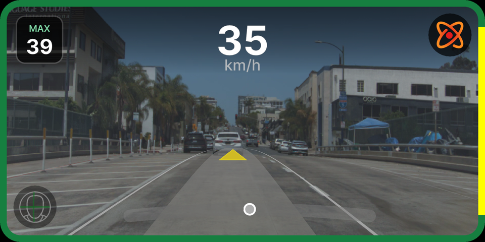

# DragonPilot Jetson AGX Xavier Port

Port do DragonPilot 0.10.3 para rodar nativamente na NVIDIA Jetson AGX Xavier.


*UI do DragonPilot rodando na Jetson AGX Xavier via replay demo — inferencia CUDA em tempo real na GPU Volta*

## Status

| Componente | Status | Detalhes |
|------------|--------|----------|
| Build system (`jarch64`) | OK | scons compila sem erros, nvcc para CUDA kernels |
| Hardware abstraction | OK | Classe Jetson com thermal, fan, DFS, hugepages |
| Inferencia CUDA (modeld) | OK | **15.85ms median** (CUDA zero-copy, 0% frame drops, 2.9x vs OpenCL) |
| TensorRT (opcional) | OK | Script de instalacao pronto, 2-3x speedup esperado |
| DLA (dmonitoring) | OK | Fallback chain: DLA0→DLA1→GPU TensorRT→tinygrad |
| CUDA kernels nativos | OK | transform.cu + loadyuv.cu compilados via nvcc |
| CUDA zero-copy preprocessing | OK | Tensor.from_blob, default stream, lazy GPU init |
| UI (raylib/OpenGL) | OK | 60 FPS, fullscreen, VSync, render texture |
| Replay (NVDEC) | OK | Decode HW via V4L2/CUDA hwaccel |
| Encoder (NVENC) | OK | h264_nvmpi / h264_nvenc |
| Core affinity (8 cores) | OK | SCHED_FIFO, cada processo em core dedicado |
| MPC otimizado | OK | N=24 (era 32), ~25% mais rapido |
| Cache slip_factor | OK | VehicleModel com _slip_factor_cache |
| Power management | OK | MAXN 30W dirigindo, MODE_10W estacionado |
| Fan controller PID | OK | Hysteresis 5%, protecao NaN/Inf |
| tmpfs log buffer | OK | /dev/shm staging, flush NVMe 5s |
| Huge Pages CUDA | OK | 256 x 2MB (512MB) para TLB |
| Acesso remoto (VNC) | OK | x11vnc com clip exato na UI (768x384) |
| Camera USB (webcam) | Pendente | webcamerad pronto, falta testar |
| Panda USB (CAN) | Pendente | pandad pronto, falta conectar hardware |

## Documentacao

| Documento | Descricao |
|-----------|-----------|
| [Setup Guide](SETUP_GUIDE.md) | Guia completo passo-a-passo para compilar e rodar |
| [Porting Plan](PORTING_PLAN.md) | Plano detalhado do port (Fases 0-7) |
| [Architecture Analysis](ARCHITECTURE_ANALYSIS.md) | Analise de hardware abstraction, build system, GPU pipeline |
| [File Inventory](FILE_INVENTORY.md) | Inventario de todos os arquivos modificados/criados |
| [Hardware Specs](HARDWARE_SPECS.md) | Specs da Jetson AGX Xavier vs comma Tici |

## Arquitetura do Port

```
comma Tici (Snapdragon 845)          Jetson AGX Xavier (Volta)
─────────────────────────────        ─────────────────────────────
Qualcomm Spectra ISP (camera)   →    USB webcam / MIPI CSI-2
Adreno 618 GPU (OpenCL)        →    Volta GPU (CUDA sm_72)
ION memory allocator            →    Standard OpenCL (visionbuf_cl)
tinygrad DEV=QCOM               →    tinygrad DEV=CUDA FLOAT16=1
V4L2 encoder (Qualcomm)        →    NVENC (h264_nvmpi)
Qualcomm NVDEC                  →    NVDEC (V4L2 nvv4l2dec)
AGNOS (custom Android)          →    JetPack 5.x (Ubuntu 20.04)
```

## Performance

### modeld End-to-End (CUDA Zero-Copy, benchmark 3min)

| Metrica | Valor |
|---------|-------|
| **modeld execution (median)** | **15.85ms** |
| modeld execution (P95) | 16.64ms |
| modeld execution (P99) | 17.49ms |
| **Frame drops** | **0 (0.00%)** |
| dmonitoringmodeld (median) | 20.83ms |
| FPS (avg) | 14.7 |
| GPU temp (max) | 51.0°C |
| CPU temp (max) | 53.0°C |
| **Melhoria vs OpenCL** | **2.9x (46ms → 16ms)** |

### Inferencia Individual (tinygrad CUDA Graphs)

| Metrica | Valor |
|---------|-------|
| Inferencia driving_vision | ~8.7ms |
| Inferencia driving_policy | ~3.3ms |
| Inferencia dmonitoring | ~6.5ms |
| UI FPS | 60 FPS (VSync) |
| Power mode | MAXN 30W (8 cores, GPU max) |

## Quick Start

```bash
# Na Jetson (via SSH):
cd /data/openpilot
source .venv/bin/activate
export DISPLAY=:0 BIG=1 SCALE=0.889

# Iniciar VNC + UI + Replay
x11vnc -display :0 -forever -shared -clip 1920x960+0+60 -scale 0.4 -rfbport 5900 -bg
nohup python3 -m selfdrive.ui.ui > /tmp/ui.log 2>&1 &
TERM=xterm ./tools/replay/replay --demo

# No PC: conectar VNC em 192.168.3.152:5900
```

Veja o [Setup Guide](SETUP_GUIDE.md) para instrucoes completas.
