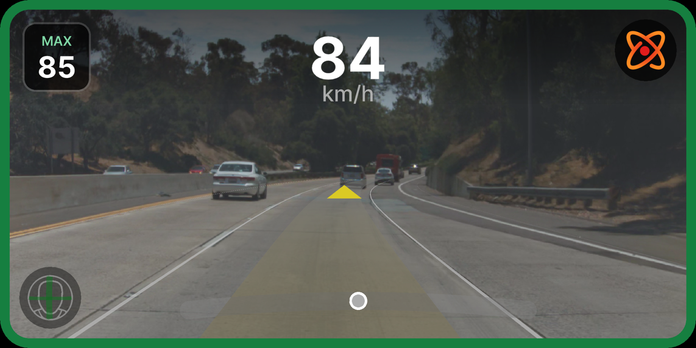

# DragonPilot Jetson AGX Xavier Port

Port do DragonPilot 0.10.3 para rodar nativamente na NVIDIA Jetson AGX Xavier.


*Visao de conducao do DragonPilot na Jetson AGX Xavier — path do modelo, lane lines, indicador de lead e DMS ativos a 1920x960*


*Visao de conducao com lane lines, DMS e camera — 13.66ms median, 20 FPS*

## Status

| Componente | Status | Detalhes |
|------------|--------|----------|
| Build system (`jarch64`) | OK | scons compila sem erros, nvcc para CUDA kernels |
| Hardware abstraction | OK | Classe Jetson com thermal, fan, DFS, hugepages |
| Inferencia CUDA (modeld) | OK | **13.66ms median, 20 FPS, 0% frame drops, 3.4x vs OpenCL** |
| dmonitoringmodeld | OK | **20.65ms median, CUDA zero-copy + DLA/TRT fallback** |
| TensorRT (opcional) | OK | Script de instalacao pronto, 2-3x speedup esperado |
| DLA (dmonitoring) | OK | Fallback chain: DLA0→DLA1→GPU TensorRT→tinygrad |
| CUDA kernels nativos | OK | transform.cu (__ldg() Volta cache) + loadyuv.cu via nvcc sm_72 |
| CUDA zero-copy (driving + dmon) | OK | Tensor.from_blob, default stream, lazy GPU init, ring buffer circular |
| fill_model_msg batched | OK | 42 .tolist()→~12, bulk T.tolist() conversions |
| UI (raylib/OpenGL) | OK | Core 6, VSync, 60 FPS, centered window, model lines active |
| Replay (NVDEC) | OK | 3-tier: h264_nvv4l2dec → CUDA hwaccel → software (NV12/NV21/YUV420P) |
| Encoder (NVENC) | OK | 3-tier: h264_nvmpi (L4T) → h264_nvenc → software, CBR zero-latency |
| Core affinity (8 cores) | OK | SCHED_FIFO, distribuicao otimizada, UI core 6, encoderd core 3 |
| Power management | OK | MAXN 30W dirigindo, MODE_10W estacionado |
| BEAM=2 autotuner | OK | Kernel optimization para Volta sm_72 |
| Display mapping | OK | 2160x1080 → 1920x960 (SCALE=0.889), centered on HDMI |
| Camera USB (webcam) | Pendente | webcamerad pronto, falta testar |
| Panda USB (CAN) | Pendente | pandad pronto, falta conectar hardware |

## Benchmarks Reais (60s, 1200 frames)

| Metrica | Valor |
|---------|-------|
| modeld median | **13.66ms** |
| modeld P95/P99 | 14.74ms / 15.64ms |
| modeld FPS | **20.0 (estavel)** |
| dmonitoringmodeld median | **20.65ms** |
| Frame drops | **0 (0%)** |
| Erros (>50ms) | **0** |
| CPU temp | 48.9C avg / 49.0C max |
| GPU temp | 48.5C avg |
| GPU usage | 8.6% |
| RAM usage | 18.0% (~5.8 GB / 32 GB) |

## Documentacao

| Documento | Descricao |
|-----------|-----------|
| [Setup Guide](SETUP_GUIDE.md) | Guia completo passo-a-passo para compilar e rodar |
| [Operational Guide](../../JETSON_SETUP.md) | Como rodar na Jetson (SSH, VNC, replay, benchmark) |
| [Optimization Details](../../JETSON_OPTIMIZATION.md) | Todas as otimizacoes, benchmarks, bugs, arquivos |
| [Porting Plan](PORTING_PLAN.md) | Plano detalhado do port (Fases 0-7) |
| [Architecture Analysis](ARCHITECTURE_ANALYSIS.md) | Analise de hardware abstraction, build system, GPU pipeline |
| [File Inventory](FILE_INVENTORY.md) | Inventario de todos os arquivos modificados/criados |
| [Hardware Specs](HARDWARE_SPECS.md) | Specs da Jetson AGX Xavier vs comma Tici |

## Core Affinity (8 cores ARM Carmel)

| Core | Processo | Prioridade | Funcao |
|------|----------|------------|--------|
| 0 | locationd, calibrationd | 5 | Estimacao |
| 1 | controlsd | 53 (FIFO) | Controle veicular |
| 2 | card | 53 (FIFO) | Interface do carro |
| 3 | encoderd, modeld | 52-54 (FIFO) | Encoding + inferencia CUDA |
| 4 | modeld | 54 (FIFO) | Inferencia CUDA |
| 5 | selfdrived | 53 (FIFO) | Estado do sistema |
| 6 | dmonitoringmodeld, UI | 5/51 | Monitoramento + renderizacao |
| 7 | plannerd, radard, dmonitoringd, paramsd, lagd, torqued | 5-51 | Planejamento + baixa prioridade |

## Arquitetura do Port

```
comma Tici (Snapdragon 845)          Jetson AGX Xavier (Volta)
─────────────────────────────        ─────────────────────────────
Qualcomm Spectra ISP (camera)   →    USB webcam / MIPI CSI-2
Adreno 618 GPU (OpenCL)        →    Volta GPU (CUDA sm_72, zero-copy)
ION memory allocator            →    cudaHostRegisterMapped (GPU-direct)
tinygrad DEV=QCOM               →    tinygrad DEV=CUDA FLOAT16=1 TC=1 BEAM=2
V4L2 encoder (Qualcomm)        →    NVENC (h264_nvmpi)
Qualcomm NVDEC                  →    NVDEC (V4L2 nvv4l2dec)
AGNOS (custom Android)          →    JetPack 5.x (Ubuntu 20.04)
Display 2160x1080 (native)     →    1920x960 (SCALE=0.889, centered)
modeld ~12ms                    →    modeld 13.66ms (competitive)
```

## Quick Start

```bash
cd /data/openpilot
./scripts/jetson_replay.sh --demo
# VNC: conectar em 192.168.3.152:5900 (768x384)
```

Veja o [Operational Guide](../../JETSON_SETUP.md) para instrucoes completas.
